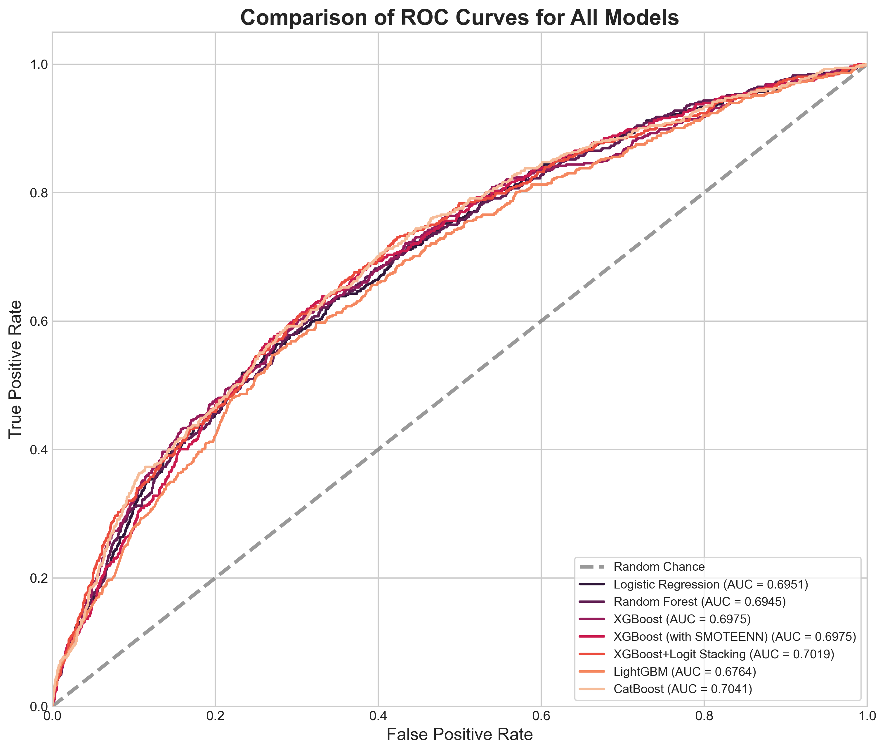
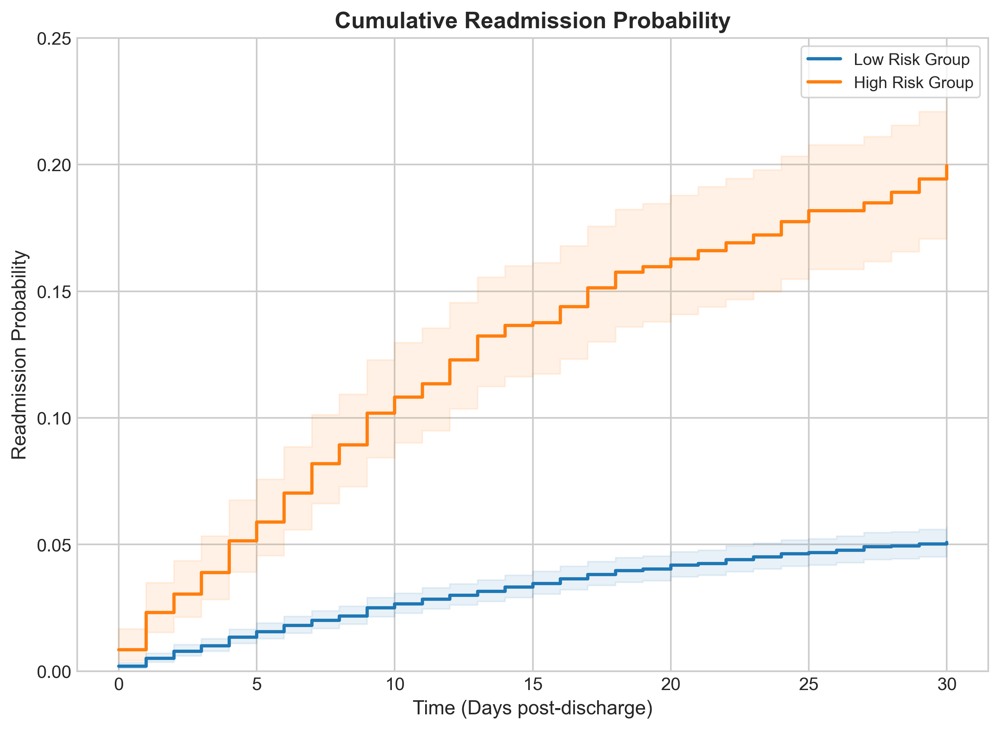

# Project Overview
Cardiovascular disease is the leading cause of death in the U.S. Hospital readmissions related to these conditions significantly impact both patient outcomes and healthcare costs. Readmission rates are often used as a benchmark for care quality across health systems.

In this project I used five different machine learning models to predict 30-day readmissions in patients with cardiovascular disease. The main models I used in this project include Logistic Regression, Random Forest, XGBoost, CatBoost, and LightGBM. I also combined Logistic Regression with the best-performing model, XGBoost in a hope to see improved performance. Accurate predictions of readmittance can help with timely interventions, improve post-discharge care, and reduce overall healthcare burden.

---

## Comparison of model performance

| Model                 | Accuracy | F1 Score | Recall | Precision | ROC AUC | Brier Score | Threshold |
|-----------------------|----------|----------|--------|-----------|---------|--------------|-----------|
| Logistic Regression   | 0.8241   | 0.2250   | 0.3633 | 0.1630    | 0.6910  | 0.0632       | 0.1080    |
| Random Forest         | 0.8639   | 0.2371   | 0.3008 | 0.1957    | 0.6945  | 0.1514       | 0.5120    |
| XGBoost               | 0.8317   | 0.2488   | 0.3965 | 0.1812    | 0.6975  | 0.1514       | 0.5320    |
| XGBoost+LR Stacking   | 0.8778   | 0.2546   | 0.2969 | 0.2229    | 0.7019  | 0.2264       | 0.7040    |
| LightGBM              | 0.8449   | 0.2175   | 0.3066 | 0.1685    | 0.6615  | 0.0650       | 0.0990    |
| CatBoost              | 0.8548   | 0.2601   | 0.3633 | 0.2026    | 0.7041  | 0.1500       | 0.5570    |

---

## ROC Cuve for different machine learning based prediction model

---

## Impactful features on prediction

---

## Distribution of impacts of each feature

---

## Risk stratification of patients with heart disease

XGBoost model was used to predict the risk of readmission for cardiovascular patients. For this, I used the threshold that gave the best F1-score. The Kaplan-Meier results displayed a distinct difference in readmission rates across the groups. At 7 days, the readmission rate for the high-risk group was 8.6%, compared to a 2.1% readmission rate for the low-risk group. This increased at the 14-day mark where the readmission rates were 14.2% for the high-risk group compared to 3.5% for the low-risk group. This rate for high-risk group continued to rise through the 30-day mark providing support to the model's identification of patients who may require additional post-discharge support.

---

I am currently wirking on this project. Will update soon. 
