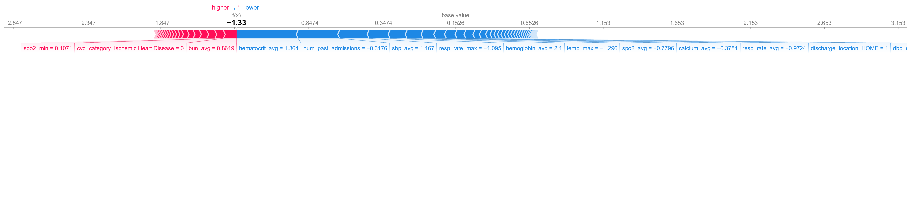
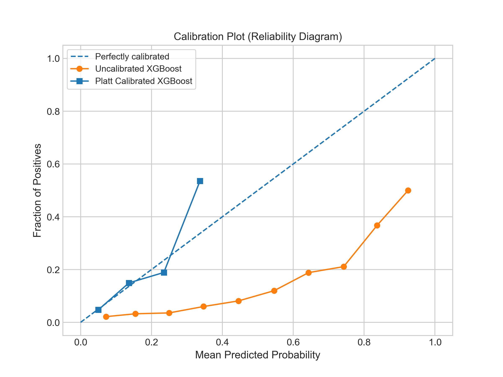

# Problem Statement: 
Cardiovascular disease is the leading cause of death in the U.S and globally. Hospital admissions and readmissions related to these conditions significantly impact both patient outcomes and healthcare costs. The goal of this project is to develop a predictive model to identify cardiovascular patients at high risk of readmission within 30 days of discharge using MIMIC-III clinical database.

---

# The Challenge of Imbalanced Datasets:
The main challenge of this project was the severe class imbalance. My analysis revealed that about 7% of patients in the dataset were readmitted within the 30-day window. This imbalance made it difficult for a standard machine learning model to learn the patterns of the minority class, leading to a high number of missed predictions.

---

# Methodology:

## 1. Data processing and feature engineering:

<ins>I. Data source:</ins> I used a subset (cardiovascular ICD-9) of clinical MIMIC-III datasets. [Johnson, A., Pollard, T., & Mark, R. (2016). MIMIC-III Clinical Database (version 1.4). PhysioNet. RRID:SCR_007345. https://doi.org/10.13026/C2XW26] The features I primarily included are- demographic features, hospital admissions, and lab results and I used SQL to extract these features from the original database. 

<ins>II. Feature engineering:</ins> Raw datasets were transformed into meaningful features for the models. This includes identifying time difference between admissions, transforming ICD-9 codes to clinically relevant features, dealing with missing values, dealing with outliers, scaling, one hot encoding and selecting most relevant features.

<ins>III. Handling class imbalance:</ins> I explored two main strategies- using SMOTE-ENN and a class imbalance weight (scale_pos_weight) directly within the model.

## 2. Model comparison

I performed a comprehensive comparison of several machine learning algorithms to identify the best-performing model for this task. The primary goal was to find a model that could effectively distinguish between classes. To this end, I evaluated each model using multiple metrics, including recall, F1-score and ROC-AUC for the minority class.

 

## 3. Hyperparameter tuning:

I used RandomizedSearchCV to fine-tune the hyperparameters for optimal performance of different models. It helped me to explore a wide range of parameter combinations in a reasonable amount of time.

## 4. Final model selection 

| Model | Accuracy | F1 Score | Recall | Precision | ROC AUC | Brier Score | Optimum Threshold |
| :--- | :--- | :--- | :--- | :--- | :--- | :--- | :--- |
| Logistic Regression | 0.8440 | 0.2396 | 0.3496 | 0.1823 | 0.6951 | 0.2133 | 0.6310 |
| Random Forest | 0.8639 | 0.2371 | 0.3008 | 0.1957 | 0.6945 | 0.1514 | 0.5120 |
| XGBoost | 0.8317 | 0.2488 | 0.3965 | 0.1812 | 0.6975 | 0.1514 | 0.5320 |
| XGBoost+SMOTEENN | 0.8112 | 0.2297 | 0.4004 | 0.1610 | 0.6975 | 0.1210 | 0.4380 |
| XGBoost+Logit Stacking | 0.8778 | 0.2546 | 0.2969 | 0.2229 | 0.7019 | 0.2264 | 0.7040 |
| LightGBM | 0.8060 | 0.2111 | 0.3691 | 0.1478 | 0.6764 | 0.0651 | 0.0940 |
| CatBoost | 0.8548 | 0.2601 | 0.3633 | 0.2026 | 0.7041 | 0.1500 | 0.5570 |

Based on a combination of high F1 score, good recall, and a high ROC-AUC, I selected the XGBoost model with class imbalance weight. It presented a strong balance of performance metrics that are critical for this problem, without the added complexity of a stacking model.

# Model Explainability and Interpretation (SHAP)
I used SHAP (SHapley Additive exPlanations) to interpret the the prediction of the model and impactful features. This is crucial for gaining clinical trust and understanding which specific feature was more important for readmission.

| Shap summary Plot      | Shap impactful features|
| ---------------------- | ---------------------- |
|  |  |

I generated SHAP force plots for two individual cases: a patient correctly predicted as high-risk and another correctly predicted as low-risk. These plots illustrate the features that most significantly contributed to each prediction.

# Post-Modeling Analysis and Impact
To demonstrate the real-world utility of the model, I performed several post-modeling analyses:

<ins>I. Probability calibration:</ins> I calibrated output probabilities of the best XGBoost model to ensure the predicted probability truly corresponded a true chance of readmission.

<ins>II. Risk stratification:</ins> I used F1-score threshold to categorize the entire patient cohort into a high-risk group and a low-risk group. This provides a clear, actionable way to prioritize patients for intervention.

<ins>III. Survival analysis (Kaplan-Meier):</ins> To validate the effectiveness of the risk stratification, I created a Kaplan-Meier survival curve. This plot shows the probability of readmission of the high-risk group versus the low-risk group. The significant separation of the curves provides a compelling visual proof that the model successfully identified patients with different risk profiles.

# Results and Limitations
While the model's overall accuracy is high, the low precision and recall for the readmission class highlight the inherent difficulty of this problem. The model's predictions serve as a valuable tool for risk prioritization but should be used in conjunction with clinical judgment.

# What I Learned and Next Steps
This project was a comprehensive exercise in developing a complete machine learning solution for a challenging clinical problem. It taught me the importance of

<ins>I. Systematic model comparison:</ins> Evaluating multiple models and metrics (using scores like recall, F1-score and ROC AUC) to make a data-driven choice.
 
<ins>II. Handling class imbalance:</ins> Understanding the trade-offs of different techniques like scale_pos_weight versus SMOTE or SMOTE-ENN.

<ins>III. Model explainability:</ins> The power of using tools like SHAP in high-stakes domains.

<ins>IV. Actionable insights:</ins> Moving beyond raw predictions to create actionable insights, such as risk stratification.

To further enhance this work, I would explore more advanced feature engineering, such as patient comorbidity scores, medication adherence data, or specific clinical event timelines to capture additional predictive signal.

I am currently wirking on this project. Will update soon. 
